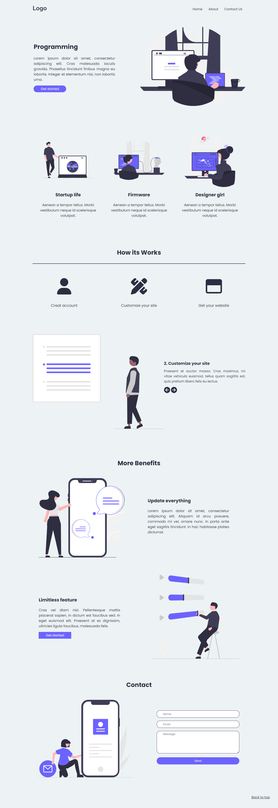

# Programming Landing Page
Esta é uma Landing Page que foi projetada para fornecer informações sobre programação e atrair potenciais interessados no assunto. A página possui um layout responsivo e moderno, com seções bem definidas para fornecer uma experiência agradável ao usuário. Sinta-se à vontade para usar essa landing page como como ponto de partida e personalizá-la de acordo com suas necessidades específicas.
<br>
<br>


# Recursos
A página possui os seguintes recursos:

- Design moderno e atraente.
- Layout responsivo para diferentes dispositivos.
- Seções organizadas para fácil navegação.
- Conteúdo informativo sobre programação.
- Formulário de contato para interação com os usuários.

# Tecnologias
As seguintes tecnologias foram utilizadas para criar essa página:

- HTML: Linguagem de marcação usada para estruturar e exibir o conteúdo da página.
- CSS: Linguagem de estilo usada para estilizar os elementos HTML e criar o design visual da página.
- JavaScript: Linguagem de programação usada para adicionar interatividade à página e fornecer recursos dinâmicos.
- Slick Carousel: Uma biblioteca JavaScript usada para criar um carrossel de imagens responsivo.
- Google Fonts: API do Google que fornece uma variedade de fontes gratuitas para uso na página.
- Font Awesome: Biblioteca de ícones vetoriais que adiciona ícones elegantes e personalizados à página.

# Utilização

Para utilizar essa Landing Page na sua máquina siga os seguintes passos:

- Clone o repositório para sua máquina local utilizando o seguinte comando:
```bash
  git clone https://github.com/ViniciusQuintas/programming-landing-page.git
```
- Após clonar o repositório, navegue até o diretório da Landing Page no terminal:
```bash
  cd programming-landing-page
```
- Agora, abra o arquivo index.html no seu navegador para visualizar a página em ação.

# Contribuição
Se você deseja contribuir para o desenvolvimento dessa Landing page, siga os seguintes passos:

1️⃣ Faça um fork deste repositório. 
<br>
<br>
2️⃣ Crie uma nova branch para sua contribuição. 
<br>
<br>
3️⃣ Faça suas alterações no código. 
<br>
<br>
4️⃣  Certifique-se de que suas alterações não quebram o funcionamento existente da página. 
<br>
<br>
5️⃣ Faça um pull request com suas alterações. 
<br>
<br>

# Licença
Este projeto está licenciado sob a Licença MIT. Consulte o arquivo LICENSE para obter mais informações.
